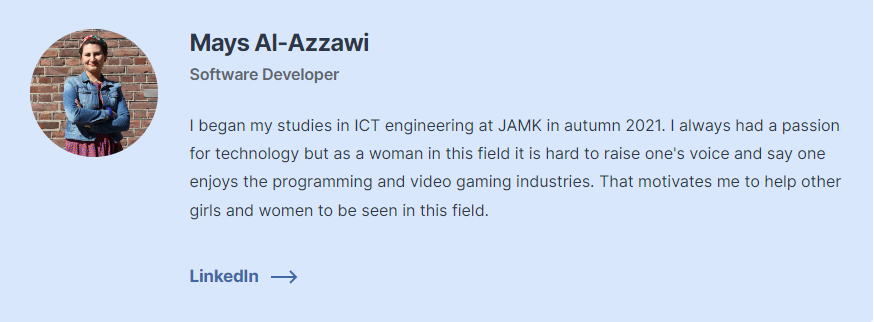

# WIMMA-Lab project  [www.Wimmalab.org](https://www.wimmalab.org/) 
## Overflow Team :
Team Overflow's task is to design a forum service for WIMMA Lab learning environment based on the open-source Conduit software. The forum includes all the features one would typically expect in a modern forum service. The team is primarily comprised of students in JAMK's ICT engineering program.

Demo on the project : [Conduit](https://test.conduit.wimmalab.org/)
### Technologies
React
NodeJS
Kubernetes
GitLab CI/CD
Docker
CSC
MongoDB
Express

